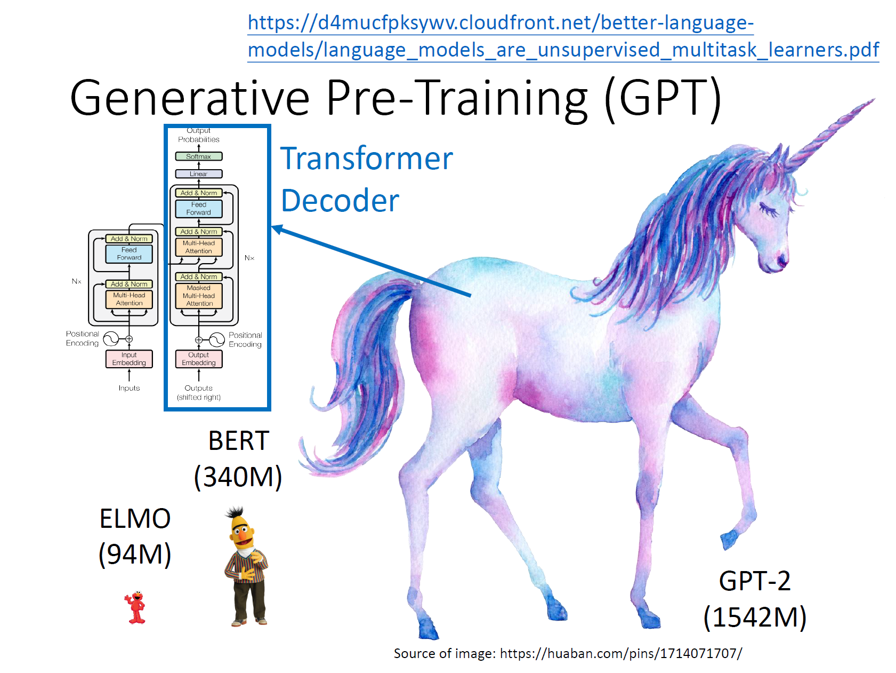
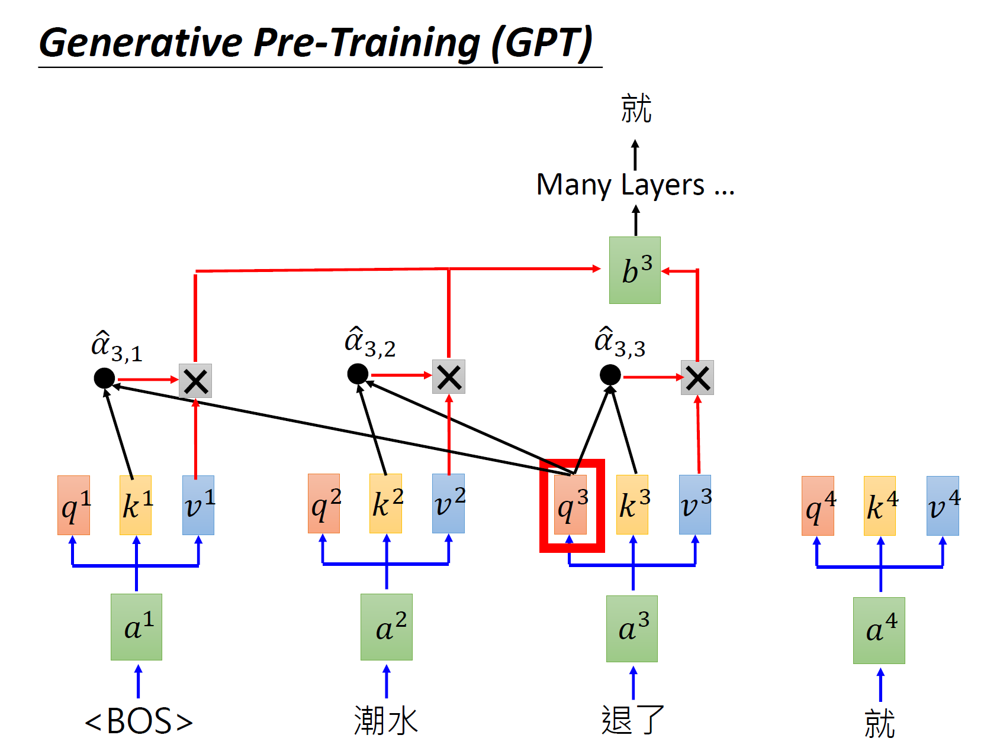

# BERT、GPT

## 基本概念

如何让机器读懂人类的文字？

我们需要将文字进行一定的编码，以便输入机器进行进一步的处理。

编码的方式，会显著影响机器对文字的理解和处理效果，所以这一步已经被证明非常重要。

在这方面，目前最先进的架构是BERT [2]和GPT []。这一篇笔记则旨在对两者进行一个总结。

本文的GPT部分，主要旨在对GPT-2继续一个简要的笔记，对于更新、更强大的GPT-3，后续会尝试对论文单独进行一次读paper的笔记总结。

GPT-3有多强大，相信很多人都已经被轰炸过了，真是迫不及待地想要亲自试一下。

GPT-3的API已经开放测试申请了，感谢趣的同学可以去https://beta.openai.com/申请一下，我的申请暂时还没有消息。。。

## BERT

BERT的全称为Bidirectional Encoder Representations from Transformers。

BERT的结构，则是Transformer的encoder，其参数可以通过对大量没有标注文本进行训练来得到。

关于transformer，之前的笔记则已经进行了总结，可以参阅transformer的笔记。

from [1]

总体来说，BERT做的事情，则是接受一个序列，输出这个序列每个节点的编码。同时这里李宏毅老师也提到一个trick，对于中文训练来说，带入BERT的序列以每一个字为节点，可能比一个词为节点更为恰当。因为相比单字，中文的词组合要更多，本身在输入到BERT之前，也要将每一个节点表示为One-Hot编码的形式再输入，词的组合的One-Hot向量就会非常长（除非有一定降维的准测）。

### 如何训练BERT？
由于BERT的架构已经再Transformer中进行了介绍，那么我们则比较关心这种embedding的结构，都有哪些训练的方式？

- 无监督训练
  1. Masked LM "完形填空": 一个序列约15%的词汇会被盖住，训练BERT把盖住的词汇填回来。我们输入一个序列，对于盖住的词对应的输出加入一个线性的多分类器，来计算预测值和损失函数的反馈。由于线性多分类器非常弱，所以这就要求BERT必须抽出比较好的编码表达，从而让线性多分类器进行预测。
  - 如果两个词填在同一个地方没有违和感，则两个词具有相似的embedding
  - 
  - from [1]

  2. Next Sentence "预测是否是接着的下一句"：此时对于输入序列，需要增加两个节点，[CLS]表示判别节点，用来输出被分割的两句是否构成上下文的关系，[SEP]表示分割节点，用来指示分割上下文的节点。
  - [CLS]放在句子的开口还是结尾还是中间，对于基于transformer的BERT，关系不大。
  - 
  - from [1]

- 一般两种方式同时使用，用来训练BERT的embedding结构。

- 有监督训练
  1. 直接使用BERT一起学习文本分类任务，结合线性分类器，此时BERT最好已经有一定预训练过的参数，在分类任务中再fine-tune。
  - 
  - from [1]
  
  1. 带入BERT进行slot filling训练，即输入一个句子，输出句子中的每一个词，属于什么类别。同样可以结合线性分类器。
  - 
  - from [1]
  3. 带入BERT学习Natural Language Inference自然语言推论。输入一个premise前提，让机器学习这个前提下的假设是否成立或是未知。
  - 
  - from [1]
  4. 带入bert进行Extraction-based QA抽取式的问答系统的训练。想要达到的效果是，输入一篇文章，然后输入想问的问题，希望机器根据文章给出答案。不过Extraction-based意思是我们假设问题的答案一定出现在文章里。
  - 输入有文章和对应的问题，输出有2个整数，两个整数表示答案在文章的第几个词到第几个词。

  - 
  - from [1]
  - 输入的形式是如何呢？同样引入[CLS]和[SEP]，分割问题的序列和文章的序列，输出embedding。
  - 然后对于输出，再学习两个跟输出同大小的向量。比如ppt中红色的vector，跟每一个embedding做dot product，再输出softmax来预测答案的第一个词的位置。然后蓝色的vector同样跟每一个embedding做dot product，输出softmax来预测答案的最后一个词位。
  - 那么当开头的位置跟结尾的位置预测结果是矛盾的时候，则代表没有答案。
  - 
  - from [1]
  - 
  - from [1]

### Bert的每一层学到了什么？
在实际应用中，经常需要采用多层的BERT结构来获得不错的效果，那么BERT的每一层都学习到了什么呢？

可以集合很多实际工作中，对于BERT的分析，来有所了解。

例如从[2]的研究当中，研究者发现BERT可以重新再现传统意义上NLP算法工作的pipeline。

from [3]

即从简单到难的pipeline上的任务，会体现在BERT每一层权重的分布逐渐偏向深层这样的现象上。

对于比较简单的任务，比如词性标注，可以发现相对浅层的BERT权重较高。

对于比较难的任务，例如解析出文中实体与实体的关系类型，则可能发现BERT的从浅到深的每一层都很重要，意味着解决这个问题需要更多的深层。

### Multilingual BERT

在文献[4]中，也是在世体现了BERT的强大能力。

研究者使用104种语言分别训练了同一个BERT结构，最后，其可以自动学习到不同语言的映射关系，并可以直接做翻译。

即对翻译，做到了zero-shot learning，不需要准备大量的翻译对应训练样本，只要将单一文字的样本，分别使用BERT进行训练。

## GPT

GPT全称为Generative Pre-Training，是一个参数空间硕大无比的语言模型，GPT-2有1542M的参数 (一看就知道是个烧钱的主)。

from [1]

穷搞理论，富搞计算。。。

GPT的架构，实际上是Transformer的Decoder。

那么开始训练的时候，GPT实际上也是一个masked multi-head attention的形式。

from [1]

输入某一个长度的序列之后，只会对这个长度的序列之前的节点对应的heads做attention，来学习预测序列之后的下一个词。

然后，输入序列长度会加一，模型这是就只会新长度的节点对应的heads做attention，来学习预测再下一个词，以此类推。

这个过程，实际上也是可以并行运行的，只是需要主要不同长度的序列所参与训练的head是有限制的。

### GPT-2的神技，zero-shot learning

对于无监督训练好的GPT，可以再多种特定任务中直接展示出相关能力。

比如阅读理解，文章摘要生成，翻译等，均在没有输入指定任务的训练数据的情况下，便可以达到一定的效果，有些效果甚至达到了state-of-art模型的水平。

当然GPT-2直接用在文章摘要生成和翻译上结果是比较差的，但是能够展现一定的能力。

### GPT-2层间可视化

可以参看文献：
https://arxiv.org/abs/1904.02679
可以看出来，文章的开头貌似大量地被attend到，可能是因为在不知道需要attend到哪里的时候，就默认到文章的开头。

### GPT-3

https://arxiv.org/abs/2005.14165

2020年，GPT-3横空出世，带来了更加惊人的效果，很多文章应该都已经膜拜过了，还引发了很多人对于自己职业被替代的怀疑和思考。。

可以看出这方面的进展是非常exciting，也跟很多人息息相关，无论你是否从事人工智能相关的工作。

有时间也会读相关的论文，做笔记整理一下。

## 参考文献

[1] [李宏毅machine leaning2020](http://speech.ee.ntu.edu.tw/~tlkagk/courses_ML20.html)

[2][BERT](https://arxiv.org/abs/1810.04805)

[3][Bert rediscovers NLP pipelines](https://arxiv.org/pdf/1905.05950.pdf)

[4][Multilingual BERT](https://arxiv.org/abs/1904.09077)

[5][GPT](https://d4mucfpksywv.cloudfront.net/better-language-models/language_models_are_unsupervised_multitask_learners.pdf)