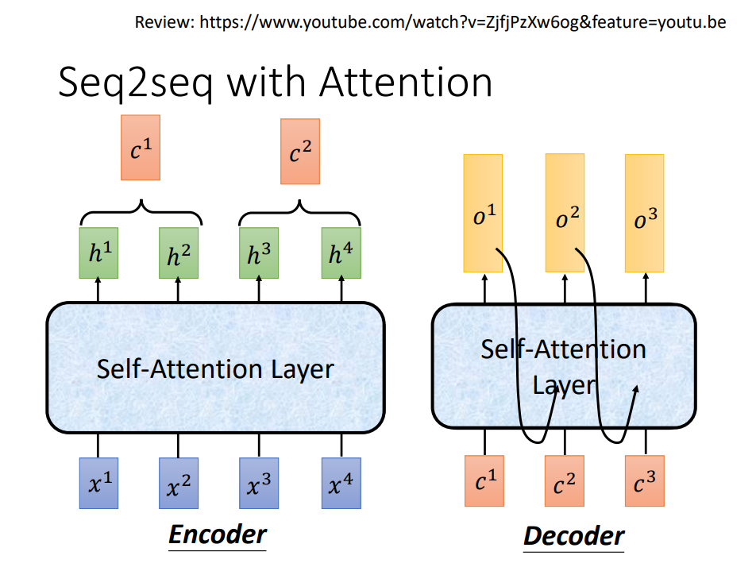
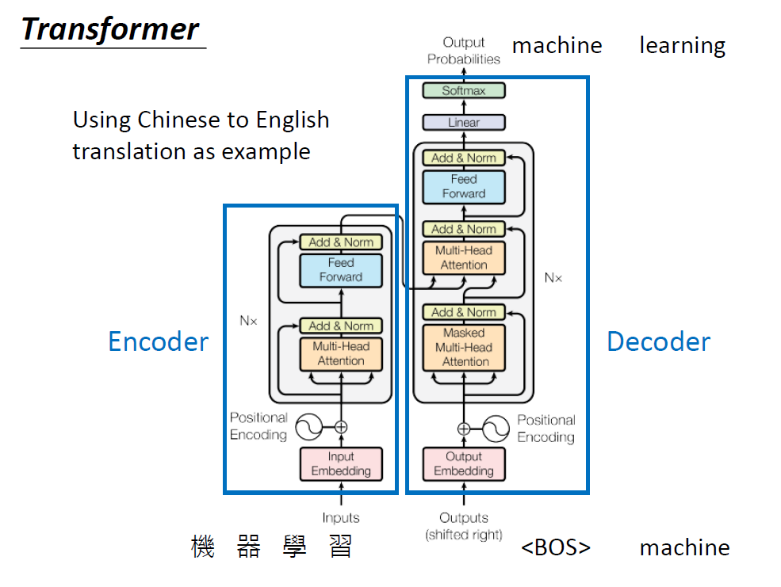
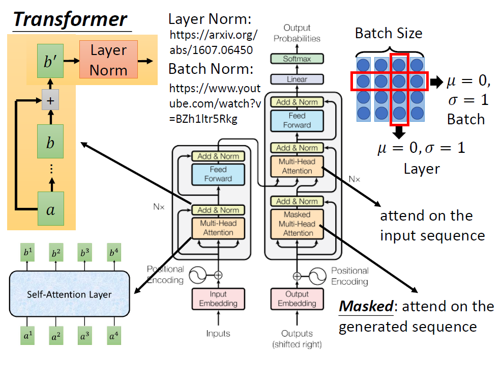

# Transformer

2020年机器学习课程笔记系列，尽可能减少冗余的描述，旨在通过一条条短文字干货的方式，在读者对相关基本知识有了一定掌握的假设基础上，方便快速地通过本笔记理解与复习关键的干货知识点。

## 基本概念

作为NLP领域近两年最重要的进展之一，Transformer基本就是必须要了解的知识之一。

Transformer本质是一个seq2seq model，其中大量地使用了self_attention layer。

对于seq2seq中的处理序列的网络单元结构，最基本常见的，是RNN。

RNN输入和输出均为序列信息，假设输入的序列是$a_0,a_1,a_2,\cdots,a_n$，对应输出的序列是$b_0,b_1,b_2,\cdots,b_n$。

如果RNN是单向的single directional，那么在输出$b_0$时，网络已经输入过$a_0$, 在输出$b_1$时，网络已经输入过$a_0,a_1$, 依次类推。

如果RNN时双向的bidirectional，那么即指在输出每一个$b_0,b_1,b_2,\cdots,b_n$的时候，每一次输出前，都已经输入过所有的$a_0,a_1,a_2,\cdots,a_n$。

RNN不容易并行化，且对于比较长的序列也会有早前的信息逐渐被弱化的情况。

采用LSTM对长序列训练的记忆问题有所缓解，但是attention结构的发明进一步改进了这个问题。

直到self-attention，则是完全取代了RNN，可以直接作为编码序列数据的更优网络结构。

谷歌在attention is all you need论文中提出了self-attention的网络架构，可以取代RNN原来可以做的事情。

可以简单认为self-attention是一种新的处理序列的网络结构，跟RNN一样，输入一个序列，输出一个序列。

同时，self-attention具有双向RNN的特点，即输出序列的每一个节点输出的时候，网络就已经见过所有输入的序列节点信息了。

相比RNN，self-attention可以轻易的并行化训练。

综上，所谓的Transformer，即采用了self-attention的seq2seq。

以后会提到的大名鼎鼎的Bert和GPT，前者基本结构是Transformer的encoder部分，后者基本结构是Transformer的decoder部分。

## 网络结构与数学表达
这个Self-attention到底是什么样的结构？内部在进行怎样的数学运算？

1.设输入的序列为$\{x_1,x_2,x_3,\cdots,x_n\}$，那么每一层首先经过一轮embedding的映射，即矩阵相乘$a_i=Wx_i$，将$x_i$转化为$\{a_1,a_2,a_3,\cdots,a_n\}$，然后输入self-attention 层当中。

2.在self-attention中，则将$a_i$乘以三种不同的transformation/matrix，产生三种不同的vector。这三种vector分别以$q_i,k_i,v_i$来表示，含义（功能）分别为：
   
   - q: query（用来跟其他的序列节点进行查询匹配）
   $$
   q_i=W_qa_i
   $$

   - k: key (用来被q匹配的权重)
   $$
   k_i=W_k a_i
   $$

   - v: 代表该节点被抽取的信息权重
   $$
   v_i=W_v a_i
   $$

3.所谓的匹配，是怎么匹配呢？对于每一个节点的$q_i$，则与每一个其它节点的$w_i$做attention。简单来说attention，就是输入2两个向量，然后输出一个分数，代表2个向量有多匹配。不过如何达成上边的效果，则有各式各样不同的做法。
   
在self-attetion layer中，实现方式叫Scaled Dot-Product Attention，即将$q_i$和$w_i$做dot product（$q_i$和$w_i$的维度一致）,再用$q_i$和$w_i$的维度$d$的平方根来归一化：
$$
   \alpha_{1,i}=(q_1\cdot k_i) / \sqrt{d}
$$
为什么要除以$\sqrt{d}$呢，self-attention的论文中有一个简单的注脚，注脚中假设$q_i$和$k_i$向量中每一个参数都是来自于均值为0，方差为1的分布，故$q_1\cdot k_i$为一个均值为0，方差为$\sqrt{d}$的分布，所以这里对方差进行归一化，即除以$\sqrt{d}$。

当得到所有的$\{\alpha_{1,1},\alpha_{1,2},\cdots,\alpha_{1,n}\}$之后，则通过一个softmax进行映射
$$
\hat{\alpha}_{1,i}=\exp({\alpha_{1,i}})/\sum^{i=n}_{i=1}\exp(\alpha_{1,i})
$$

4.得到了所有的attention向量$\hat{\alpha}_{j,i}$之后，再与节点信息权重$v_i$做weighted sum，得到输出节点$b_{j}=\sum_{i} \hat{\alpha}_{j,i}\cdot v_{i}$。

到这里，可以注意到，为了产生输出序列的某一个节点$b_{j}$，观察到了整个序列的信息，这样对于输入序列的任何一个节点，不管远近，都通过transformation+attention的方式，被$b_{j}$观察到了。这样的设计，也是self-attention机制对于处理长序列信息能力强大的来源之一。

另外，还能够注意到的是，输出序列的所有输出节点$\{b_{j}\}$，都可以同时并行计算出来，这样的方式将序列模型并行化。

## **self attention 进行平行化的方式**

对于$q_i=W_q\cdot a_i$，将运算的参数进行矩阵沿列方向（axis=1）拼接，得到相同的算式：
$$
\underbrace{[q_1,q_2,q_3,\cdots,q_n]}_{Q}=W_q\cdot \underbrace{[a_1,a_2,a_3,\cdots,a_n]}_{I}
$$

以此类推，对于$k_i=W_k\cdot a_i$，将运算的参数进行矩阵拼接，得到相同的算式：
$$
\underbrace{[k_1,k_2,k_3,\cdots,k_n]}_{K}=W_k\cdot \underbrace{[a_1,a_2,a_3,\cdots,a_n]}_{I}
$$

对于$v_i=W_v\cdot a_i$，将运算的参数进行矩阵拼接，得到相同的算式：
$$
\underbrace{[v_1,v_2,v_3,\cdots,v_n]}_{V}=W_v\cdot \underbrace{[a_1,a_2,a_3,\cdots,a_n]}_{I}
$$

接下来，对于每一个$q_i$和所有的$k_i$来做inner product,对于一个$q_i$，可以同时计算所有的attention。

$$
\underbrace{\begin{vmatrix}
\hat{\alpha}_{1,1} & \hat{\alpha}_{2,1} & \cdots \\
\hat{\alpha}_{1,2} & \hat{\alpha}_{2,2} & \cdots \\
\hat{\alpha}_{1,3} & \hat{\alpha}_{2,3} & \cdots \\
\cdots \\
\hat{\alpha}_{1,n} & \hat{\alpha}_{2,n} & \cdots \\
\end{vmatrix}}_{\hat{A}}\leftarrow_{softmax}\leftarrow
\underbrace{\begin{vmatrix}
\alpha_{1,1} & \alpha_{2,1} & \cdots \\
\alpha_{1,2} & \alpha_{2,2} & \cdots \\
\alpha_{1,3} & \alpha_{2,3} & \cdots \\
\cdots \\
\alpha_{1,n} & \alpha_{2,n} & \cdots \\
\end{vmatrix}}_{A}=
\underbrace{\begin{vmatrix}
k_{1} \\
k_{2} \\
k_{3} \\
\cdots \\
k_{n} \\
\end{vmatrix}}_{K^{T}}
\cdot
\underbrace{\begin{vmatrix}
q_1 & q_2 & q_3 & \cdots & q_n
\end{vmatrix}}_{Q}
\sqrt{d}
$$

最后，对于输出的序列，最后通过attention的矩阵与所有的$v$做矩阵运算，则同时得到序列矩阵：
$$
\underbrace{\begin{vmatrix}
b_{1} & b_{2} & \cdots & b_{n} \\
\end{vmatrix}}_{O}=

\underbrace{\begin{vmatrix}
v_1 & v_2 & v_3 & \cdots & v_n
\end{vmatrix}}_{V}
\underbrace{\begin{vmatrix}
\hat{\alpha}_{1,1} & \hat{\alpha}_{2,1} & \cdots \\
\hat{\alpha}_{1,2} & \hat{\alpha}_{2,2} & \cdots \\
\hat{\alpha}_{1,3} & \hat{\alpha}_{2,3} & \cdots \\
\cdots \\
\hat{\alpha}_{1,n} & \hat{\alpha}_{2,n} & \cdots \\
\end{vmatrix}}_{\hat{A}}
$$

最后，总结来看，从输入的矩阵$I$，到输出的矩阵$O$，所做的事情，则是一连串的矩阵乘法，可以用GPU并行化。

## **Multi-head Self-attention**

在实际应用的架构中，可以把$q_i$、$k_i$以及$v_i$，分别再乘以两个（或m个）不同的矩阵，从而“分裂”为不同的head。

例如$q_i$可以分裂为$q_{i,1}$和$q_{i,2}$两个head，之后的运算中，$q_{i,1}$只和$k_{i,1}$,$v_{i,1}$进行交互运算，最后两个head可以得到两种输出$b_{i,1}$和$b_{i,2}$。

这样的设计，可以让不同的head结构，关注解析序列中不同的部分。有的head可以看本地的信息，或者有的head可以看到长序列上的信息。从而增强解析序列的能力。

## Positional Encoding

到这里我们可能会注意到，self-attention结构是将一个序列整体解析，并没有专门考虑到相对位置的信息。

这样的计算过程，对于序列中的一个节点，对其周围节点的运算或最远距离节点的运算，实际上是一样的，按照李宏毅老师的说法，就是“天涯若比邻”。

在原始的文章中，引入了一个位置向量positional vector $e_i$，并在一开始将$e_i$进行向量加法累加到$a_i$上。这个位置向量的参数值并不是通过数据学习到的，且维度与$a_i$一致。

当然，我们可以问，为什么要将$e_i$与$a_i$相加，为什么不直接将两者做一个concatenate？这里其实偏向于一个开放性的问题，可以按照自己的想法选择或构建一个认为合适的引入位置向量的方式。

这里首先记录一下李宏毅老师课堂上讲到的一种做法：对于序列中的每一个词向量，concatenate一个one-hot形式的顺序向量$p_i$，同时对于计算embedding表达的$W$，则由两个部分构成$W_{I}$与$W_{P}$，运算的过程可以看作$W_{I}$与$W_{P}$分别与$x_i$与$p_i$做矩阵乘法，然后将结果拼接在一起。

$$
\begin{vmatrix}
W_I & W_P 
\end{vmatrix}
\begin{vmatrix}
x_i \\
p_i \\
\end{vmatrix}=
\underbrace{\begin{vmatrix}
W_I 
\end{vmatrix}
\begin{vmatrix}
x_i 
\end{vmatrix}}_{a_i}+
\underbrace{\begin{vmatrix}
W_P 
\end{vmatrix}
\begin{vmatrix}
p_i 
\end{vmatrix}}_{e_i}
$$

对于$W_p$，当然通过训练得到，但是根据一些之前卷积神经网络构造seq2seq的一些经验，训练$W_p$的效果并不怎么好。于是这里positional-encoding的向量是通过人为构造的，并且在训练中固定保持不变。

论文中给出的$W_p$编码参数公式为：
$$
PE(pos,2i)=\sin(\frac{pos}{10000^{\frac{2i}{d_{model}}}})
$$
$$
PE(pos,2i+1)=\cos(\frac{pos}{10000^{\frac{2i}{d_{model}}}})
$$
其中pos为序列中的维度位置，即单词的位置，i为在embedding中的维度位置。$d_{model}$为embedding的维度。

构造的向量可视化情况如下所示：

from [2]

图中纵轴为序列中的每个维度，横轴为embedding的每个维度，颜色代表该位置在矩阵中的数值大小。生成该图的代码 [click here](https://github.com/jalammar/jalammar.github.io/blob/master/notebookes/transformer/transformer_positional_encoding_graph.ipynb)。

从这样的构造方式，可以看出构造的权重不仅需要体现出词的绝对位置的不同，还要体现出词和词之间相对位置的不同。

如何构造出更好的位置编码向量，这个暂时还是开放的问题。

## Transformer
通过上面的铺垫，可以比较细节地了解transformer中用到的self-attention到底是怎样的一个矩阵变换形式。那么transformer作为一个seq2seq的算法，总体的形式是什么样的呢？从大的视角来看，对于原始的Seq2Seq搭配attention的做法，曾经是用RNN作为编码序列信息的元件，那么现在我们可以用self-attention来替代RNN：

from [1]

在参考文献[3]中，google则给出了一个比较形象的encoding、decoding过程中的参数交互过程，可以参考一下。

对于tansformer，经常可以见到的示意图如下，在经过上边的拆解后，可以对这个复杂的图有一个更清晰的认识。

from [1]

- 这里首先可以看左边编码器encoder的部分，输入input会通过embedding进行编码，然后结合postional-encoding，作为multi-head attention的输入，到这里前边都有详细描述。

   对于Add & Norm部分，则是将multi-head的输入$\{a_1,a_2,\cdots \}$和multi-head的输出$\{b_1,b_2,\cdots \}$通过向量相加加起来，即$a_i+b_i=b'_i$。随后，再将$b'_i$进行[layer normalization](https://arxiv.org/abs/1607.06450)。

      *layer normalization与batch normalization有什么不同？*

      batch normalization，即是将同一个batch中的同一个特征维度的数值统计分布，调整为均值为0，方差为1的高斯分布。

      layer normalization，则是将同一个batch的同一个样本的所有不同维度的数值统计分布，调整为均值为0，方差为1的高斯分布。这一归一化主要在循环神经网络中经常使用，在self-attention的情况下，同样可以使用这样的norm方法。

   Add & Norm部分之后，会输入一个前馈神经网络，输出再进入一个Add & Norm的部分，之后进入到decoder当中。

- 对于decoder部分，其输入是上一个时序的输出，同样通过embedding和positional encoding进入到重复N次的灰色block中。

   这里接下来跟encoder不同的是，接下来的流程首先会进入一个masked multi-head attention。这里的含义是，attention的映射操作只会考虑到这步时已经生成的sequence的multi-head，而不会去对还没有生成的sequence去做attention。

   接下来，在经过一个Add & Norm的处理后，与encoder部分的输出一起，输入到一个multi-head attention当中，最后在经过前馈神功网络以及softmax的映射，得到最终输出的序列。

## transformer思想可以用在哪里？

-  要用到seq2seq的场景，都可以考虑用transformer替换
  
   [参考论文连接](https://arxiv.org/abs/1801.10198)

- Universal transformer

   [参考博客连接](https://ai.googleblog.com/2018/08/moving-beyond-translation-with.html)

- self-attention也可以用在图像上

   [参考论文连接](https://arxiv.org/abs/1805.08318)

## 参考文献

[1] [李宏毅machine learning2020](http://speech.ee.ntu.edu.tw/~tlkagk/courses_ML20.html)

[2] [jalammar-blog](http://jalammar.github.io/illustrated-transformer/)

[3] [google-transformer-blog](https://ai.googleblog.com/2017/08/transformer-novel-neural-network.html)
